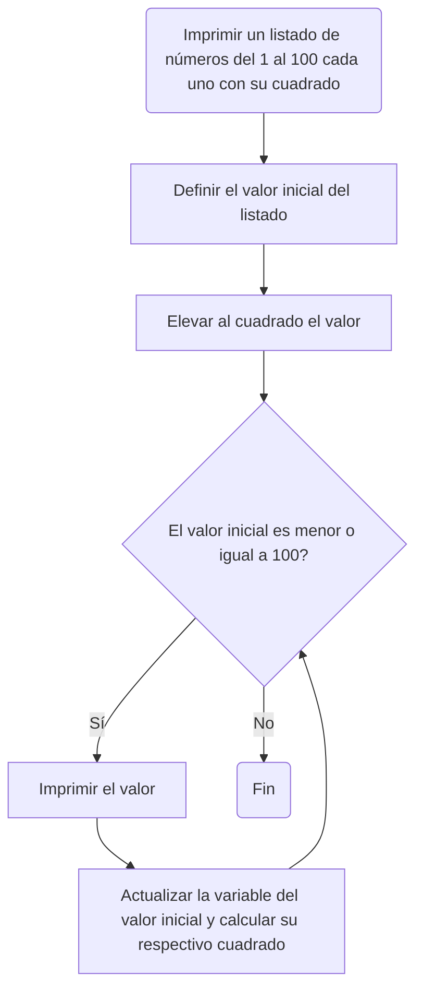
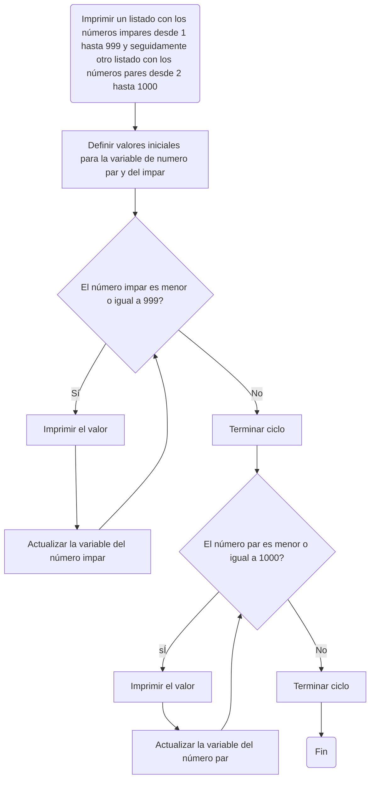
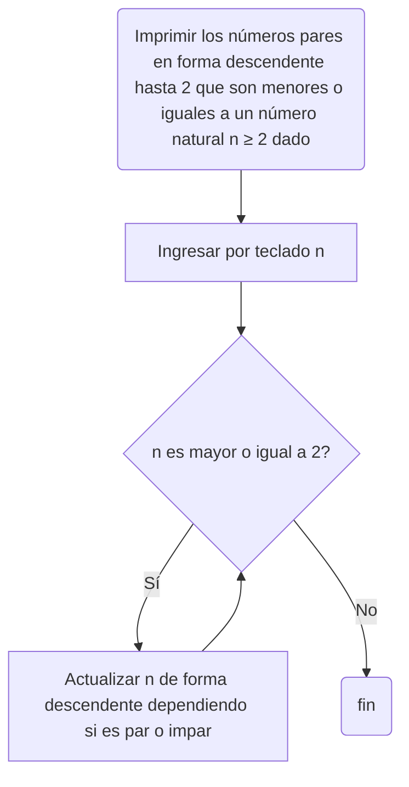

# Ciclos en python
## 1.Imprimir un listado con los números del 1 al 100 cada uno con su respectivo cuadrado

```python
num: int = 1 #Se define el número inicial del listado a imprimir
cuadrado: int = num**2 #Se eleva al cuadrado este primer número sin iterar
while num <= 100: #se establece que 'mientras que el número sea menor o igual a 100'
  print(num, cuadrado) #Imprimir número con su respectivo cuadrado
  num += 1 # Se incrementa el número desde 1 hasta 100
  cuadrado: int = num**2 #Se establece el cuadrado para cada incremento de la variable 'num'
```

## 2. Imprimir un listado con los números impares desde 1 hasta 999 y seguidamente otro listado con los números pares desde 2 hasta 1000


```python
impar:int = 1 #primero se declaran e inicializan las variables
par: int = 2
while (impar <= 999):  #Se dice que mientras el numero impar sea menor o igual que 999 se actualice de dos en dos
  print(impar)
  impar += 2

while (par <= 1000): #Se dice que mientrasbel numero par sea menor o igual a 1000 se actualice de dos en dos
  print(par)
  par += 2
# Se ponen dos ciclos, uno para cada tipo de número ya que cada variable tiene un valor inicial diferente
```

## 3.Imprimir los números pares en forma descendente hasta 2 que son menores o iguales a un número natural n ≥ 2 dado

```python
n = int(input("Ingrese un número mayor o igual a 2: ")) #Se ingresa por teclado el n mayor o igual a 2

while (n >= 2):
  print(n) #Se imprimen los numeros descendentemente desde n dado
  if  n%2 == 0:
    n -=2
  else:
    n -=1   #Se establecen los condicionales respectivos dependiendo si n es par o impar
```

## 4.En 2022 el país A tendrá una población de 25 millones de habitantes y el país B de 18.9 millones. Las tasas de crecimiento anual de la población serán de 2% y 3% respectivamente. Desarrollar un algoritmo para informar en que año la población del país B superará a la de A.

```python
pob_A_2022 : int = 25e6
pob_B_2022 : float = 18.9e6 #Se declaran e inicializan las variables de las poblaciones iniciales
anual: int = 2022 #Se define la variable del año
while (pob_B_2022 < pob_A_2022): #Se establece el ciclo de que, mientras A sea mayor a B haga:
  print(pob_A_2022 , pob_B_2022, anual, sep= ' , ') #Imprimir las poblaciones en los respectivos años
  pob_A_2022 = pob_A_2022  + (0.02)*pob_A_2022
  pob_B_2022 = pob_B_2022 + (0.03)*pob_B_2022 #Actualizar las variables con los porcentajes correspondientes
  anual += 1 #Actualizar el año
print(pob_A_2022 , pob_B_2022, anual, sep= ' , ') #Imprimir el año en que la población de B será mayor que la de A, este print se encuentra fuera del ciclo
print("En " +str(anual)+ " la población de B será mayor que la de A ") #Dar un mensaje al usuario
```

## 5.Imprimir el factorial de un número natural n dado.
```python
numero = int(input("Ingrese un número entero positivo ")) #Pedir el ingreso por teclado de un numero natural
valor: int = 1
fac: int = 1 #Aquí se toma como referencia el numero 1 como valor inicial y 'fac' como el factorial de 1
while (valor <= numero): #mientras el valor ingresado por teclado sea mayor o igual a 1 hacer:
  fac = fac*valor
  valor +=1 #Actualizar la variable del factorial, al igual que la de 'valor' hasta que esta última sea igual a la ingresada por teclado
print ('El factorial del número es ' +str(fac)) #Imprimir el factorial del número
```

## 6. Implementar un algoritmo que permita adivinar un número dado de 1 a 100, preguntando en cada caso si el número es mayor, menor o igual.
``` python
lim_ma:int = 100
lim_me:int = 1 #Rango de números
num:int = (lim_ma + lim_me) // 2 #parte entera de la mitad del rango
respuesta: str = "" #Respuesta del usuario
adivinado: bool = False # Establecer en False para que entre en el ciclo

while not adivinado: #Mientras el numero no sea adivinado:
  respuesta = input("El número es mayor a " + str(num) + "? (s/n) ") # preguntar al usuario si el numero pensado es mayor a la mitad, s es si, n es no


  if respuesta == "s": # Si la respuesta es sí (s):
    lim_me = num + 1 # Aumentar el limite inferior un número
    num = (lim_ma + lim_me) // 2 #Nueva mitad
  elif respuesta == "n":
    respuesta = input("El número es menor a " + str(num) + "? (s/n) ") # Preguntar al usuario si el número pensado es menor a la mitad
    if respuesta == "s": # Si la respuesta es sí
      lim_ma = num - 1 # Aumentar el limite superior un número
      num = (lim_ma + lim_me) // 2 #Nueva mitad
    else: # Si la respuesta es no (n):
      adivinado = True # El numero es adivinado
  else: # Si no se digita 's' ni 'n'
    print("Digite una respuesta válida")

print("El número que pensó es: " + str(num)) # Imprimir el número adivinado
```

## 7. Implementar un programa que ingrese un número de 2 a 50 y muestre sus divisores

```python
num: int = int(input("Ingrese un número entre 2 y 50: ")) #Número ingresado por teclado
div: int = 1 #Se inicia con el primer divisor de cada número
print("Los divisores de " +str(num)+ " son: ") #Imprimir mensaje
while (div <= num): #mientras el divisor sea menor que el número hacer que:
  if num % div == 0:
    print (div)
  div += 1         #si el residuo entre el numero y el divisor es 0, imprimir el divisor, esto se evalúa con cada actualización de la variable 'div'
```
## 8. Implementar el algoritmo que muestre los números primos del 1 al 100. Nota: use funciones

```python
n_i: int  #Se declara la variable del listado de numeros de 1 a 100
i: int #'Sublista' de divisores de cada n_i
num: int = 2 #variable del ciclo, que empieza en 2, ya que si se pone como valor inicial el 1, se imprimirá como primo con el condicional establecido en la siguiente función (asumir con anterioridad que el 1 no es primo)

def calcular_primos(n_i)-> int:  #Definición de la función para calcular números primos
  for i in range(2, int((n_i**0.5) + 1)): #porque todos son divisibles por 1, y la condición evalúa que tenga un solo divisor
    if n_i % i == 0:
      return False # No se retorna en la función debido a que estamos evaluando que este número tenga un solo divisor
  return True

while (num <= 100): # establecer que la variable, mientras sea menor a 100:
  if calcular_primos(num): #si cumple la condición de ser primo, imprimir el número
    print(num)
  num += 1 #Con la debida actualización de la misma
``` 
